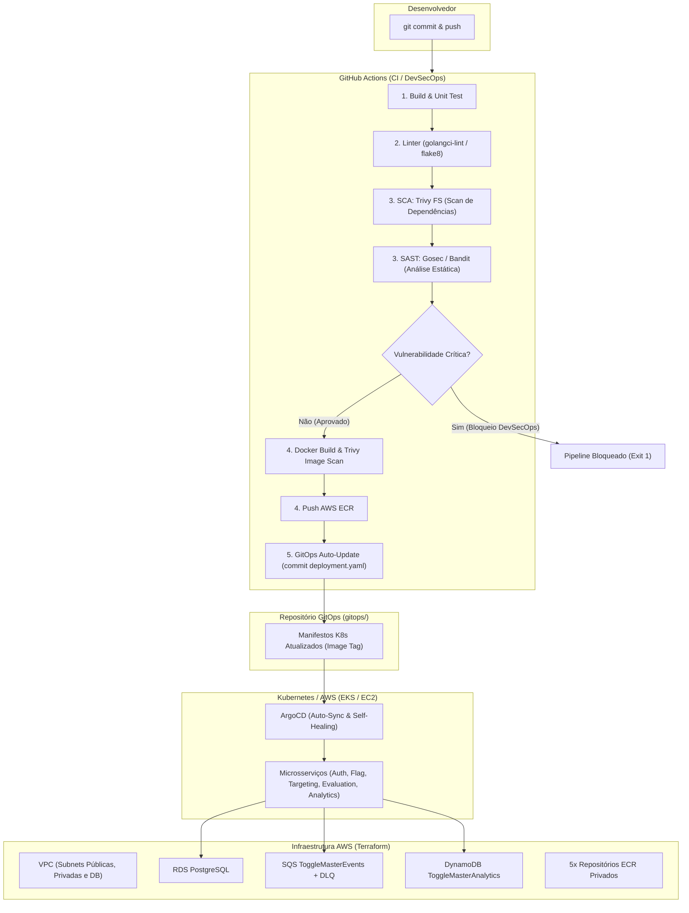

# ToggleMaster - Fase 3: Automação e Segurança na Nuvem


Projeto oficial do **Tech Challenge - Fase 3 (Pós-Tech FIAP)** focado na evolução e automação dos microsserviços do **ToggleMaster** através de:
- **Infraestrutura como Código (Terraform modular)** com suporte nativo a **AWS Free Tier ($0/mês)** e arquitetura corporativa completa.
- **Pipelines de Integração Contínua com DevSecOps (GitHub Actions)** cobrindo Linter, SCA (Trivy), SAST (Gosec / Bandit) e Container Security Scan.
- **Entrega Contínua orientada a GitOps (ArgoCD)** com versionamento automático de tags de imagens nos manifestos.
- **Destruição Automatizada (Teardown Script)** para limpeza total dos recursos em nuvem.

---

## 👥 Integrantes do Grupo
- **Erisvam Herdley Da Silva Santos**
- **Felipe Sousa Da Silva**
- **Rafael Andrade Ferretto**

---

## 🏗️ 1. Arquitetura da Solução e Fluxo CI/CD + GitOps



---

## 📁 2. Estrutura do Repositório

```text
.
├── .github/
│   └── workflows/
│       ├── ci-auth-service.yml          # Pipeline DevSecOps Auth (Go)
│       ├── ci-flag-service.yml          # Pipeline DevSecOps Flag (Python)
│       ├── ci-targeting-service.yml     # Pipeline DevSecOps Targeting (Python)
│       ├── ci-evaluation-service.yml    # Pipeline DevSecOps Evaluation (Go)
│       ├── ci-analytics-service.yml     # Pipeline DevSecOps Analytics (Python)
│       └── iac-terraform.yml            # Pipeline de validação e scan do Terraform
├── services/                            # Código fonte e testes dos 5 microsserviços
│   ├── auth-service/                    # Go 1.22 + Testes Unitários + Dockerfile
│   ├── flag-service/                    # Python 3.12 + Testes Unitários + Dockerfile
│   ├── targeting-service/               # Python 3.12 + Testes Unitários + Dockerfile
│   ├── evaluation-service/              # Go 1.22 + Testes Unitários + Dockerfile
│   └── analytics-service/               # Python 3.12 + Testes Unitários + Dockerfile
├── terraform/                           # Infraestrutura Principal (Padrão 100% Free Tier)
│   ├── backend.tf                       # S3 Remote Backend com use_lockfile
│   ├── main.tf                          # Orquestração modular
│   ├── variables.tf                     # Parametrização (enable_free_tier = true)
│   ├── outputs.tf                       # Endpoints e identificadores gerados
│   └── modules/
│       ├── compute/                     # Instância EC2 t3.micro (Free Tier)
│       ├── networking/                  # VPC sem custos de NAT Gateway
│       ├── databases/                   # RDS db.t3.micro + DynamoDB On-Demand
│       ├── messaging/                   # Fila SQS ToggleMasterEvents e DLQ
│       ├── ecr/                         # 5 Repositórios ECR com ciclo de retenção
│       └── eks/                         # Módulo EKS para arquitetura completa
├── arquitetura-completa/                # Infraestrutura Enterprise Multi-RDS + EKS + Redis
├── gitops/                              # Manifestos Kubernetes para ArgoCD
│   ├── argocd-apps/                     # Application Root (App-of-Apps)
│   └── apps/                            # Manifestos de cada microsserviço
├── scripts/                             # Scripts utilitários de automação
│   ├── setup-remote-backend.sh          # Criação interativa e segura do S3 Backend
│   ├── teardown-aws.sh                  # Destruição completa dos recursos AWS
│   ├── test-devsecops-local.sh          # Execução de testes unitários locais
│   └── simulate-security-fail.sh        # Simulação de bloqueio DevSecOps
├── docs/                                # Documentação técnica detalhada
│   ├── arquitetura.md                   # Documentação de arquitetura e infraestrutura
│   ├── devsecops.md                     # Shift-Left Security: SCA, SAST e Container Scan
│   ├── gitops.md                        # Operação contínua via GitOps e ArgoCD
│   └── relatorio_entrega.md             # Relatório formal com identificação do grupo
└── README.md
```

---

## 🚀 3. Guia de Execução Passo a Passo

### Pré-requisitos
- **AWS CLI v2** configurado (`aws configure`)
- **Terraform** >= v1.5.0
- **Git**

---

### Passo 1: Configurar o S3 Remote State Backend
O script seleciona seu perfil AWS interativamente e cria o bucket exclusivo com criptografia, versionamento e trava de concorrência:
```bash
./scripts/setup-remote-backend.sh
```
> O script exibe ao final um relatório com o status de criação e configurações do bucket S3.

---

### Passo 2: Provisionar a Infraestrutura AWS com Terraform
Por padrão, o projeto está configurado no modo **Free Tier ($0/mês)**:
```bash
export AWS_PROFILE=aws-personal
cd terraform
terraform init
terraform plan
terraform apply -auto-approve
cd ..
```

---

### Passo 3: Executar Testes Unitários e Sintaxe Localmente
Para rodar toda a suíte de testes unitários (Go e Python) e linting localmente:
```bash
./scripts/test-devsecops-local.sh
```

---

## 🔒 4. Demonstração de DevSecOps

O projeto possui um script automatizado para demonstrar o pipeline bloqueando vulnerabilidades críticas no estágio **3. Security Scan (SCA & SAST)** e posteriormente liberando após a correção:

### 1. Simular Falha de Segurança (Bloqueio pelo Trivy)
```bash
# Injeta dependência com CVE crítica no flag-service
./scripts/simulate-security-fail.sh fail
git commit -am "test: inject vulnerable dependency for devsecops demo"
git push origin main
```
> ❌ **Comportamento esperado**: O GitHub Actions executa os testes unitários, o linter e **falha no estágio 3 (Security Scan)** devido às vulnerabilidades críticas apontadas pelo Trivy no arquivo `requirements.txt`. O build e push da imagem são bloqueados.

### 2. Aplicar Correção (Pipeline Passando 100%)
```bash
# Remove a dependência vulnerável
./scripts/simulate-security-fail.sh fix
git commit -am "fix: remove vulnerable dependency"
git push origin main
```
> ✅ **Comportamento esperado**: O pipeline passa por todos os 5 estágios:
> 1. `Build & Unit Test`
> 2. `Linter & Static Analysis`
> 3. `Security Scan (SCA & SAST)`
> 4. `Docker Build, Scan & Push (ECR)`
> 5. `GitOps Auto-Update (Atualiza tag da imagem no repositório)`

---

## 🧹 5. Destruição Completa da Infraestrutura (Teardown)

Para evitar qualquer cobrança desnecessária na AWS após os testes, execute o script de teardown:

```bash
./scripts/teardown-aws.sh
```

O script:
1. Permite selecionar interativamente o perfil AWS.
2. Esvazia e limpa todas as imagens dos 5 repositórios ECR.
3. Executa o `terraform destroy -auto-approve` de forma limpa e idempotente.
4. Permite opcionalmente remover o bucket de Remote State com a flag `--delete-state-bucket`.

---

## 📚 6. Documentações Adicionais
- 📘 [Documentação de Arquitetura de Nuvem e Rede AWS](docs/arquitetura.md)
- 🛡️ [Guia de DevSecOps e Segurança Shift-Left](docs/devsecops.md)
- 🔄 [Guia de GitOps e Operações ArgoCD](docs/gitops.md)
- 📋 [Relatório Oficial de Entrega & Custos](docs/relatorio_entrega.md)
