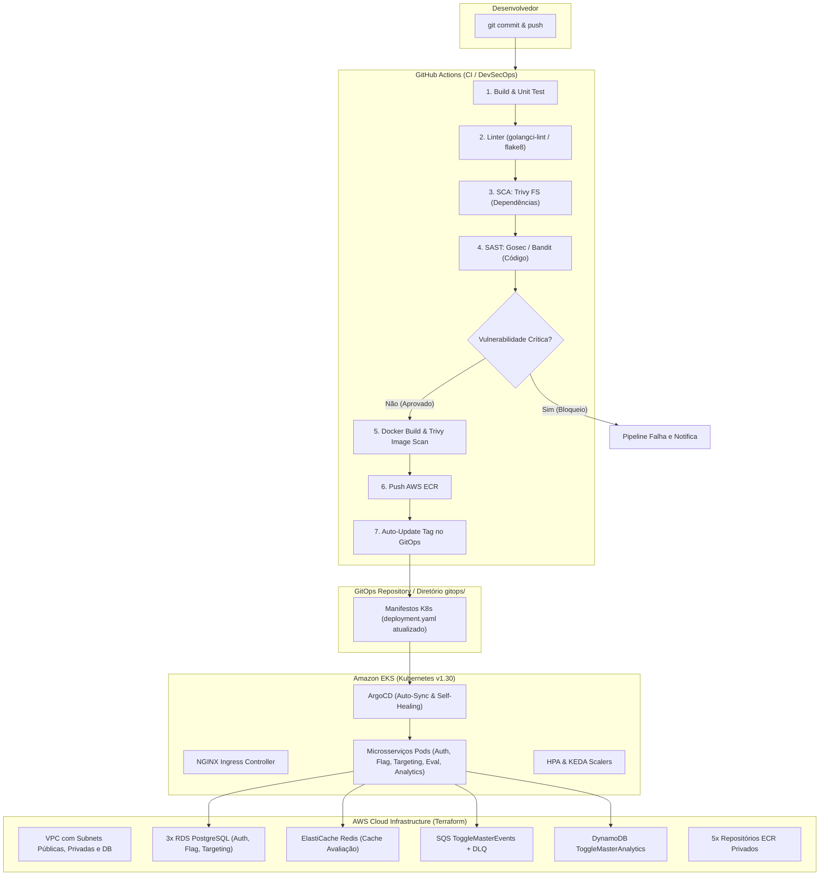

# ToggleMaster - Fase 3: Automação e Segurança na Nuvem


Projeto oficial do **Tech Challenge - Fase 3 (Pós-Tech FIAP)** focado na transformação da arquitetura de microsserviços do **ToggleMaster** através de **Infraestrutura como Código (Terraform modular)**, **Pipelines de Integração Contínua com DevSecOps (GitHub Actions)** e **Entrega Contínua orientada a GitOps (ArgoCD)**.

---

## 🏗️ 1. Arquitetura da Solução



---

## 📁 2. Estrutura do Repositório

```text
.
├── .github/
│   └── workflows/
│       ├── ci-auth-service.yml          # Pipeline DevSecOps & GitOps Auth (Go)
│       ├── ci-flag-service.yml          # Pipeline DevSecOps & GitOps Flag (Python)
│       ├── ci-targeting-service.yml     # Pipeline DevSecOps & GitOps Targeting (Python)
│       ├── ci-evaluation-service.yml    # Pipeline DevSecOps & GitOps Evaluation (Go)
│       ├── ci-analytics-service.yml     # Pipeline DevSecOps & GitOps Analytics (Python)
│       └── iac-terraform.yml            # Pipeline de validação e scan do Terraform
├── services/                            # Código fonte dos 5 microsserviços
│   ├── auth-service/                    # Go 1.22 + Testes Unitários + Dockerfile
│   ├── flag-service/                    # Python 3.12 + Testes Unitários + Dockerfile
│   ├── targeting-service/               # Python 3.12 + Testes Unitários + Dockerfile
│   ├── evaluation-service/              # Go 1.22 + Testes Unitários + Dockerfile
│   └── analytics-service/               # Python 3.12 + Testes Unitários + Dockerfile
├── terraform/                           # Infraestrutura como Código Modular
│   ├── backend.tf                       # S3 Remote Backend com use_lockfile
│   ├── main.tf                          # Orquestração de todos os módulos
│   ├── providers.tf                     # Provedores AWS, Kubernetes, Helm, TLS
│   ├── variables.tf                     # Variáveis parametrizáveis (Academy vs Pessoal)
│   ├── outputs.tf                       # Endpoints consolidados para EKS, RDS, Redis, SQS
│   ├── terraform.tfvars.example
│   └── modules/
│       ├── networking/                  # VPC, Subnets Públicas/Privadas/DB, IGW, NAT GW
│       ├── eks/                         # Cluster EKS v1.30, Node Group, OIDC/IRSA
│       ├── databases/                   # 3 RDS Postgres, ElastiCache Redis, DynamoDB
│       ├── messaging/                   # SQS ToggleMasterEvents e DLQ
│       ├── ecr/                         # 5 Repositórios ECR com lifecycle policies
│       └── argocd/                      # Helm Release ArgoCD, Ingress e Metrics Server
├── gitops/                              # Manifestos Kubernetes para ArgoCD
│   ├── argocd-apps/                     # App-of-Apps (root-application.yaml)
│   └── apps/
│       ├── base/                        # Namespace, ConfigMap, Secrets, Ingress, HPA, KEDA
│       ├── auth-service/                # deployment.yaml e service.yaml
│       ├── flag-service/                # deployment.yaml e service.yaml
│       ├── targeting-service/           # deployment.yaml e service.yaml
│       ├── evaluation-service/          # deployment.yaml e service.yaml
│       └── analytics-service/           # deployment.yaml e service.yaml
├── scripts/                             # Scripts utilitários de automação
│   ├── setup-remote-backend.sh          # Criação do S3 Bucket para state com encriptação
│   ├── test-devsecops-local.sh          # Testes unitários e linter locais
│   └── simulate-security-fail.sh        # Simulação de falha proposital para o vídeo
├── docs/                                # Documentação técnica detalhada
│   ├── arquitetura.md                   # Documentação completa de rede e infra AWS
│   ├── devsecops.md                     # Guia de segurança, SAST, SCA e Container Scan
│   ├── gitops.md                        # Guia de operação do ArgoCD e GitOps
│   ├── roteiro_gravacao.md              # Roteiro passo a passo para o vídeo (Nota Máxima)
│   └── relatorio_entrega.md             # Modelo oficial de entrega e estimativa de custos
└── README.md
```

---

## 🚀 3. Como Executar o Projeto

### Pré-requisitos
- **AWS CLI v2** configurado (`aws configure`)
- **Terraform** >= v1.5.0
- **kubectl** >= v1.28
- **Helm** v3

### Passo 1: Configurar o S3 Remote State Backend
```bash
chmod +x scripts/*.sh
bash scripts/setup-remote-backend.sh togglemaster-terraform-state-fiap us-east-1
```

### Passo 2: Provisionar a Infraestrutura AWS com Terraform
```bash
cd terraform
cp terraform.tfvars.example terraform.tfvars

# Se estiver usando AWS Academy, configure use_aws_academy = true no terraform.tfvars
# Para Conta Pessoal, mantenha use_aws_academy = false

terraform init
terraform plan
terraform apply -auto-approve
```

### Passo 3: Conectar o kubectl ao Cluster EKS
```bash
aws eks update-kubeconfig --region us-east-1 --name togglemaster-cluster
kubectl get nodes
```

### Passo 4: Conectar e Configurar o ArgoCD
```bash
# Obtenha a senha do ArgoCD admin:
kubectl get secret argocd-initial-admin-secret -n argocd -o jsonpath="{.data.password}" | base64 -d; echo ""

# Aplique o Application Root do GitOps:
kubectl apply -f ../gitops/argocd-apps/root-application.yaml
```

---

## 🔒 4. DevSecOps: Teste de Falha e Correção (Para o Vídeo)

Conforme o requisito do desafio, para demonstrar o pipeline de segurança bloqueando vulnerabilidades:

1. **Injetar vulnerabilidade**:
   ```bash
   bash scripts/simulate-security-fail.sh fail
   git commit -am "test: inject vulnerable dependency for devsecops demo"
   git push origin main
   ```
   > ❌ O pipeline falhará no estágio **3. Security Scan (SCA & SAST)** acusando CVE crítica no Trivy.

2. **Aplicar a correção**:
   ```bash
   bash scripts/simulate-security-fail.sh fix
   git commit -am "fix: remove vulnerable dependency"
   git push origin main
   ```
   > ✅ O pipeline passará por todos os 5 estágios e atualizará a tag no GitOps automaticamente.

Consulte o [Roteiro de Gravação](docs/roteiro_gravacao.md) para instruções detalhadas de apresentação.

---

## 📚 5. Documentações Adicionais
- 📘 [Arquitetura de Nuvem e Rede AWS](docs/arquitetura.md)
- 🛡️ [Guia de DevSecOps e Segurança Shift-Left](docs/devsecops.md)
- 🔄 [Guia de GitOps e ArgoCD](docs/gitops.md)
- 🎬 [Roteiro Completo de Gravação de Vídeo](docs/roteiro_gravacao.md)
- 📋 [Relatório de Entrega & Estimativa de Custos](docs/relatorio_entrega.md)
