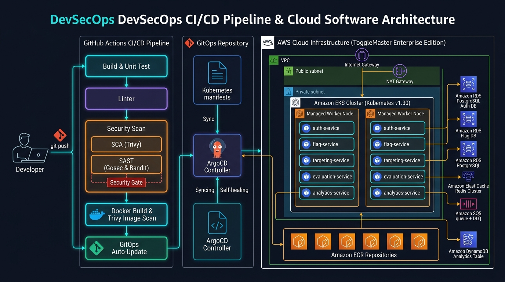

# Arquitetura de Infraestrutura em Nuvem (AWS) - ToggleMaster Fase 3

Este documento detalha a arquitetura corporativa em nuvem provisionada de forma 100% automatizada, declarativa e imutável através do **Terraform**, atendendo integralmente a todos os requisitos do Tech Challenge da Fase 3 (FIAP Pós-Tech) com foco em alta disponibilidade (**Amazon EKS v1.30**, **3x RDS PostgreSQL**, **ElastiCache Redis**, **VPC com NAT Gateway** e **ArgoCD GitOps**).

> 💡 **Nota sobre Custos**: A versão 100% Free Tier (custo zero) está preservada no diretório [`arquitetura-free-tier/`](../arquitetura-free-tier/) caso deseje validar em contas pessoais sem consumo de créditos.

---

## 1. Diagrama Geral da Arquitetura e Pipeline DevSecOps



```
+----------------------------------------------------------------------------------------------------+
| AWS Cloud (us-east-1) - VPC: 10.0.0.0/16                                                           |
|                                                                                                    |
|  [ Internet Gateway ] <---> [ Public Subnets: 10.0.1.0/24, 10.0.2.0/24 ]                           |
|                                     |                                                              |
|                                [ NAT Gateway ]                                                     |
|                                     |                                                              |
|  +----------------------------------v-----------------------------------------------------------+  |
|  | Private Subnets (EKS Managed Nodes): 10.0.10.0/24, 10.0.11.0/24                              |  |
|  |                                                                                              |  |
|  |   +---------------------------------------------------------------------------------------+  |  |
|  |   | Amazon EKS Cluster: togglemaster-cluster (Kubernetes v1.30)                           |  |  |
|  |   |                                                                                       |  |  |
|  |   |  - ArgoCD Controller (GitOps com UI Integrada)                                        |  |  |
|  |   |  - Ingress NGINX Controller                                                           |  |  |
|  |   |  - KEDA Operator & Metrics Server (Autoscaling)                                       |  |  |
|  |   |                                                                                       |  |  |
|  |   |  Pods dos 5 Microsserviços:                                                           |  |  |
|  |   |    [ auth-service ]       (Go)     : Porta 8001                                      |  |  |
|  |   |    [ flag-service ]       (Python) : Porta 8002                                      |  |  |
|  |   |    [ targeting-service ]  (Python) : Porta 8003                                      |  |  |
|  |   |    [ evaluation-service ] (Go)     : Porta 8004                                      |  |  |
|  |   |    [ analytics-service ]  (Python) : Porta 8005                                      |  |  |
|  |   +---------------------------------------------------------------------------------------+  |  |
|  +----------------------------------------------------------------------------------------------+  |
|                                     |                                                              |
|  +----------------------------------v-----------------------------------------------------------+  |
|  | Isolated Database Subnets: 10.0.20.0/24, 10.0.21.0/24                                        |  |
|  |                                                                                              |  |
|  |   [ RDS Auth ]          [ RDS Flag ]          [ RDS Targeting ]       [ ElastiCache Redis ]  |  |
|  |   (PostgreSQL 15)       (PostgreSQL 15)       (PostgreSQL 15)         (Cluster Redis 7)      |  |
|  |   Porta: 5432           Porta: 5432           Porta: 5432             Porta: 6379            |  |
|  +----------------------------------------------------------------------------------------------+  |
|                                                                                                    |
|  Managed AWS Services:                                                                             |
|    - Amazon DynamoDB: Tabela 'ToggleMasterAnalytics' (PAY_PER_REQUEST)                             |
|    - Amazon SQS: Fila 'ToggleMasterEvents' + 'ToggleMasterEvents-dlq'                              |
|    - Amazon ECR: 5 Repositórios privados com Image Scanning on Push                                |
|    - Amazon S3: Remote State Bucket com 'use_lockfile = true'                                      |
+----------------------------------------------------------------------------------------------------+
```

Ela contempla:
- **Cluster Amazon EKS v1.30** com Managed Node Groups (`t3.small`).
- **3 Instâncias RDS PostgreSQL independentes** para cada domínio de serviço.
- **Cluster Amazon ElastiCache Redis** gerenciado pela AWS.
- **ArgoCD Controller** instalado via Helm para GitOps automatizado.
- **NAT Gateway e Subnets Privadas** isoladas para os nós do Kubernetes.

Para alternar entre os ambientes no Terraform:
- **Ambiente Free Tier (Padrão)**: `enable_free_tier = true` em `terraform.tfvars`.
- **Ambiente EKS Completo**: `enable_free_tier = false` em `terraform.tfvars` (ou executar a partir de `arquitetura-completa/terraform/`).

---

## 3. Segurança e Isolamento

Independentemente do modo de execução:
- **Security Groups**: O banco de dados PostgreSQL aceita conexões apenas originadas do Security Group de aplicação.
- **Armazenamento de Senhas**: As credenciais nunca ficam hardcoded no código fonte, sendo injetadas via variáveis sensíveis no Terraform ou Secrets no ambiente.
- **Backend Remoto**: O estado do Terraform é gravado no Amazon S3 com criptografia AES-256 e controle de concorrência ativado via `use_lockfile = true`.
