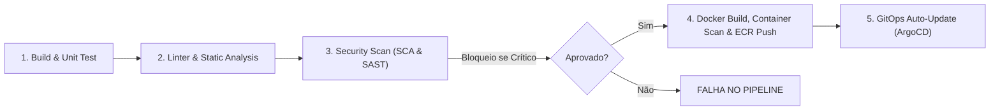

# Guia Completo de DevSecOps & Pipelines CI/CD - ToggleMaster Fase 3

Este documento apresenta a estratégia de **DevSecOps** implementada nos pipelines do GitHub Actions para os 5 microsserviços do ToggleMaster, com foco em segurança "Shift-Left", automação e políticas de bloqueio de vulnerabilidades.

---

## 1. Estrutura dos Workflows do GitHub Actions

Cada microsserviço possui seu workflow dedicado em `.github/workflows/`:
- `ci-auth-service.yml`
- `ci-flag-service.yml`
- `ci-targeting-service.yml`
- `ci-evaluation-service.yml`
- `ci-analytics-service.yml`

### Estágios (Jobs) do Pipeline



---

## 2. Ferramentas de Segurança Integradas

### 2.1 Linter & Análise Estática de Código
- **Go (`auth-service`, `evaluation-service`)**:
  - `go vet ./...` para validação de erros lógicos, ponteiros nulos e boas práticas.
- **Python (`flag-service`, `targeting-service`, `analytics-service`)**:
  - `flake8` para conformidade com a PEP8 e detecção precoce de sintaxe inválida.

### 2.2 SCA (Software Composition Analysis)
- **Ferramenta**: `aquasecurity/trivy-action` em modo `fs` (Filesystem).
- **Objetivo**: Escanear todas as dependências declaradas em `go.mod` e `requirements.txt`.
- **Regra de Bloqueio**: `--severity CRITICAL --exit-code 1`.
- **Comportamento**: Se qualquer dependência externa contiver uma vulnerabilidade de severidade **CRÍTICA**, o pipeline é imediatamente interrompido e a imagem Docker **não** é gerada nem enviada ao ECR.

### 2.3 SAST (Static Application Security Testing)
- **Go**: `securego/gosec` executado com `-severity high -confidence high`, analisando vulnerabilidades no código Go (SQL injection, hardcoded credentials, buffer overflows).
- **Python**: `bandit -r . -ll`, detectando problemas comuns no ecossistema Python (uso de `eval`, SQL injection em queries brutas, senhas estáticas).

### 2.4 Container Security Scan (Imagem Docker)
- **Ferramenta**: `aquasecurity/trivy-action` em modo `image`.
- **Objetivo**: Escanear a imagem Docker recém-construída (incluindo pacotes do sistema operacional base, bibliotecas C e binários).
- **Regra de Bloqueio**: Bloqueio obrigatório caso a imagem final apresente CVEs críticas não corrigidas.

---

## 3. Demonstração Prática para o Vídeo (Falha e Correção)

Um dos critérios avaliativos centrais da Fase 3 é:
> *"Faça uma alteração no código de um microsserviço (ex: insira um erro proposital ou uma dependência vulnerável) e mostre o pipeline falhando no passo de segurança. Depois corrija e mostre passando."*

Para facilitar testes, criamos o script utilitário `scripts/simulate-security-fail.sh`.

### Passo a Passo para os testes:

#### Etapa 1: Injetar a Dependência Vulnerável
No terminal (WSL ou Bash), execute:
```bash
bash scripts/simulate-security-fail.sh fail
```
O script adicionará `urllib3==1.24.1` (versão com a vulnerabilidade crítica **CVE-2019-11324**) no arquivo `services/flag-service/requirements.txt`.

Em seguida, faça o commit e push:
```bash
git commit -am "test: inject vulnerable dependency for devsecops demo"
git push origin main
```

#### Etapa 2: Mostrar o Pipeline Falhando no GitHub Actions
1. Abra a aba **Actions** no repositório do GitHub.
2. Mostre a execução do workflow `CI/CD Flag Service`.
3. Abra o job **3. Security Scan (SCA & SAST)**.
4. Mostre que o **Trivy FS Scan** identificou a vulnerabilidade crítica e bloqueou a execução com código de saída `1` (`exit-code 1`), impedindo a criação da imagem Docker e o envio ao ECR.

#### Etapa 3: Aplicar a Correção
No terminal, execute o comando de correção:
```bash
bash scripts/simulate-security-fail.sh fix
```
Isso remove a versão vulnerável do `requirements.txt`.

Faça o commit e push da correção:
```bash
git commit -am "fix: remove vulnerable dependency"
git push origin main
```

#### Etapa 4: Mostrar o Pipeline Passando com Sucesso
1. Volte ao GitHub Actions.
2. Acompanhe a nova execução:
   - ✅ **Build & Unit Test**: Passou.
   - ✅ **Linter**: Passou.
   - ✅ **Security Scan (SCA & SAST)**: Passou (sem vulnerabilidades críticas).
   - ✅ **Docker Build, Scan & Push**: Imagem construída, escaneada pelo Trivy e enviada com sucesso ao ECR.
   - ✅ **GitOps Auto-Update**: Manifesto Kubernetes atualizado no repositório com a nova tag da imagem gerada.
